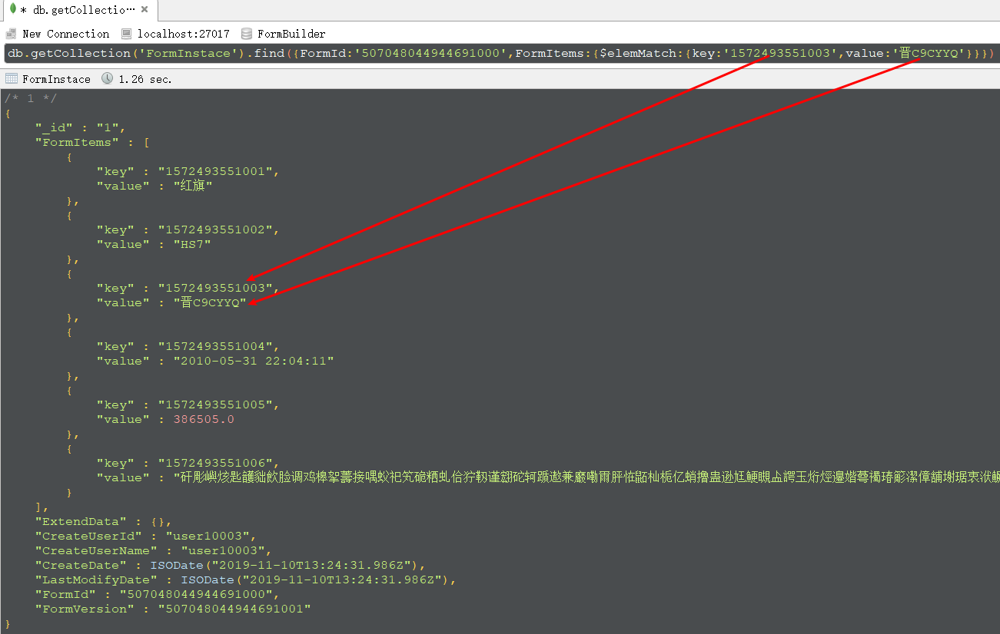

# 再谈通用查询类封装之Mongodb篇  
之前写了一篇笔记：[通用查询类封装之Mongodb篇](https://www.cnblogs.com/du-blog/p/10211141.html)，记录了封装一个通用的查询类(面向mongodb,其他的没有测试)的思路以及实现方式，当时仅是为了证明想法的可行性，并不是特别严谨，尤其是转换时需要创建助手类的实例，用起来不是很方便……现在项目上有需求了，在研究一下。    
## 1、改进查询类  
在[表单生成器(Form Builder)之表单数据存储结构mongodb篇](https://www.cnblogs.com/du-blog/p/11795583.html)这篇笔记中介绍了数据的存储结构：  
```json
{
    "_id":"主键ID",
    "FormItems":[
        {
            "key":"表单项唯一标识（这里用的是时间戳，在表单设计时生成）",
            "value":"任意类型（该表单项的值）"
        }
    ],
    "ExtendData":{},// 扩展字段
    "CreateUserId":"创建用户ID",
    "CreateUserName":"创建用户姓名",
    "CreateDate":    "创建时间",
    "LastModifyDate":"最后一次修改时间(默认为创建时间)",
    "FormId":"表单主键ID",
    "FormVersion":"对应表单的版本"
}
```  
基于上面的结构，部分的查询是在表单项`FormItems`中，并且`key`和`value`要成对出现，否则没有意义。要满足这样的查询，必须使用mongodb中的`$elemMatch`，之前在[表单生成器(Form Builder)之伪造表单数据mongodb篇](https://www.cnblogs.com/du-blog/p/11815545.html)这篇笔记中介绍了几张表并且伪造了一些数据，在这里我们查询一下‘车辆信息表’，看看车牌照是‘晋C9CYYQ’的车辆是否存在：  

    db.getCollection('FormInstace').find({FormId:'507048044944691000',FormItems:{$elemMatch:{key:'1572493551003',value:'晋C9CYYQ'}}})  

  

为了拼出上面的结构，将上篇笔记中的查询因子包装了一下，又弄了一个查询单元的概念(起名字太费劲了)：  
```c#
/// <summary>
/// 查询的值:查询操作
/// </summary>
public class QueryFactorOperator
{
	/// <summary>
	/// 要查询的字段的值
	/// </summary>
	public object Value { get; set; }

	/// <summary>
	/// 枚举类型(等值、模糊、大于等)，对要查询的字段的值进行什么操作
	/// </summary>
	public QueryOperatorKind QueryOperator { get; set; } = QueryOperatorKind.EQ;
}

/// <summary>
/// 查询因子，最小的查询单位
/// </summary>
public class QueryFactor
{
	/// <summary>
	/// 要查询的字段的名称
	/// </summary>
	public string Key { get; set; }
	
	/// <summary>
	/// 枚举类型(数值、字符串、布尔、集合等)，要查询的字段的值的类型
	/// </summary>
	public QueryValueKind ValueKind { get; set; }
	
	/// <summary>
	/// 查询操作的集合，用于实现日期、数值的区间查询
	/// </summary>
	public List<QueryFactorOperator> ValueOperators { get; set; }
}

/// <summary>
/// 最小的查询单元
/// 满足 $elemMatch 查询
/// </summary>
public class QueryUnit
{
	/// <summary>
	/// 如果该值存在，则 List<QueryFactor> Factors 之间是 and 的关系
	/// </summary>
	public string ElemMatchName { get; set; }

	/// <summary>
	/// 枚举类型(and、or)
	/// </summary>
	public LogicalOperatorKind LogicalOperator { get; set; } = LogicalOperatorKind.And;

	/// <summary>
	/// 查询因子集合
	/// </summary>
	public List<QueryFactor> Factors { get; set; }
}
```  
使用上面的查询模型，就可以实现mongodb的`$elemMatch`查询了……
## 2、实例调用修改为静态调用  
这个就没有那么所废话了，直接上代码：
```c#
 public class QueryModel2Helper<T>
{
	public static FilterDefinition<T> ToMongodbFilter(QueryModel2 queryModel)
	{
		return ToMongodbFilter2(queryModel.StrFilter, queryModel.KeyValues, new Dictionary<string, FilterDefinition<T>>());
	}

	private static FilterDefinition<T> ToMongodbFilter2(string filterStr, Dictionary<string, QueryUnit> keyValues, Dictionary<string, FilterDefinition<T>> dicFilterDefinition)
	{
		int startIndex = filterStr.LastIndexOf("(");
		if (startIndex != -1)
		{
			//  截取括号中的表达式
			int endIndex = filterStr.IndexOf(")", startIndex);
			int len = endIndex - startIndex - 1;
			string simpleExpress = filterStr.Substring(startIndex + 1, len);
			//  处理简单的表达式并结果保存到字典中
			string tempGuid = Guid.NewGuid().ToString();
			FilterDefinition<T> fd1 = HandleSimpleExpression(simpleExpress, keyValues, dicFilterDefinition);
			dicFilterDefinition.Add(tempGuid, fd1);
			//  继续处理剩余表达式
			string leftStr = filterStr.Substring(0, startIndex);
			string rightStr = filterStr.Substring(endIndex + 1);
			return ToMongodbFilter2($"{leftStr}{tempGuid}{rightStr}", keyValues, dicFilterDefinition);
		}
		return HandleSimpleExpression(filterStr, keyValues, dicFilterDefinition);
	}

	private static FilterDefinition<T> HandleSimpleExpression(string filterStr, Dictionary<string, QueryUnit> keyValues, Dictionary<string, FilterDefinition<T>> dicFilterDefinition)
	{
		//  1、筛选出操作符：&、|
		Queue<char> qOperator = new Queue<char>();
		//Regex regexOperator = new Regex("[&|]");
		//foreach (Match item in regexOperator.Matches(logicalExpression))
		//{
		//    qOperator.Enqueue(item.Value);
		//}
		foreach (char c in filterStr)
		{
			if (c == '&' || c == '|')
			{
				qOperator.Enqueue(c);
			}
		}
		//  2、筛选出所有的变量
		Queue<string> qVariable = new Queue<string>();
		string[] tempVariables = filterStr.Replace("&", ",").Replace("|", ",").Split(",");
		foreach (string v in tempVariables)
		{
			qVariable.Enqueue(v);
		}
		//  3、返回结果组装
		FilterDefinition<T> filter = null;
		if (qVariable.Count >= 1)
		{
			string tempV = qVariable.Dequeue();
			filter = dicFilterDefinition.ContainsKey(tempV) ? dicFilterDefinition[tempV] : MongodbHelper.HandleQueryUnitModel<T>(keyValues[tempV]);
			while (qVariable.Count > 0)
			{
				string rightV = qVariable.Dequeue();
				var tempFilter = dicFilterDefinition.ContainsKey(rightV) ? dicFilterDefinition[rightV] : MongodbHelper.HandleQueryUnitModel<T>(keyValues[rightV]);
				char tempOperator = qOperator.Dequeue();
				switch (tempOperator)
				{
					case '&':
						{
							filter &= tempFilter;
							break;
						}
					case '|':
						{
							filter |= tempFilter;
							break;
						}
				}
			}
			filter = Builders<T>.Filter.Empty & (filter);
		}
		return filter ?? Builders<T>.Filter.Empty;
	}
}
```  
## 3、非逻辑表达式实现
其实使用上面的代码已经完全可以搞定了，我也很喜欢这种方式，但是如果有种场景：拦截查询请求，在这个基础上添加、删除几个查询条件，此时处理起来尤其带有很多`()`时,比较费劲，所有就有了下面这种方式：
```c#
 public class QueryModel3
{
	/// <summary>
	/// 逻辑操作符：and、or
	/// List<QueryUnit> QueryUnits 之间的逻辑关系
	/// List<QueryModel2> QueryModels 之间的逻辑关系
	/// QueryUnits和QueryModels二者只能存在一个，优先使用QueryUnits
	/// </summary>
	public LogicalOperatorKind LogicalOperator { get; set; } = LogicalOperatorKind.And;

	public List<QueryUnit> QueryUnits { get; set; }

	public List<QueryModel3> QueryModels { get; set; }
}
```  
解析代码：
```c#
 public class QueryModel3Helper<T>
{
	public static FilterDefinition<T> ToMongodbFilter(QueryModel3 queryModel)
	{
		if (queryModel.QueryUnits != null && queryModel.QueryUnits.Any())
		{
			List<FilterDefinition<T>> unitFilters = new List<FilterDefinition<T>>();
			foreach (var unitItem in queryModel.QueryUnits)
			{
				var unitFilter = MongodbHelper.HandleQueryUnitModel<T>(unitItem);
				if (unitFilter != null)
				{
					unitFilters.Add(unitFilter);
				}
			}
			return MongodbHelper.HandleFilterDefinitions(unitFilters, queryModel.LogicalOperator);
		}
		else
		{
			var filter = Builders<T>.Filter.Empty;
			if (queryModel.QueryModels == null || !queryModel.QueryModels.Any()) return filter;
			List<FilterDefinition<T>> queryModelFilters = new List<FilterDefinition<T>>();
			foreach (var queryModel2Item in queryModel.QueryModels)
			{
				queryModelFilters.Add(ToMongodbFilter(queryModel2Item));
			}
			return MongodbHelper.HandleFilterDefinitions(queryModelFilters, queryModel.LogicalOperator);
		}
	}
}
```  
最后测试了几种情况，返回的查询字符都是一样的  

    1、((1|2)&3)|((1&2&4)|5)
    2、(1&((2&3&4&5)|6|7))|8
    3、1&2&3|(1&(4|5))
    4、{ "$and" : [{ "FormId" : "CarInfo" }, { "Level1" : "Apple" }, { "CreateDate" : { "$gte" : "2010-01-01", "$lte" : "2020-12-31" } }, { "FormValues" : { "$elemMatch" : { "key" : "key1", "value" : { "$ne" : "", "$lte" : "2020" } } } }, { "FormValues" : { "$elemMatch" : { "key" : "key2", "value" : { "$gte" : "2000", "$lte" : "2020" } } } }] }  

源码地址：[源码](../source/DDZ.MongoDBConsole)